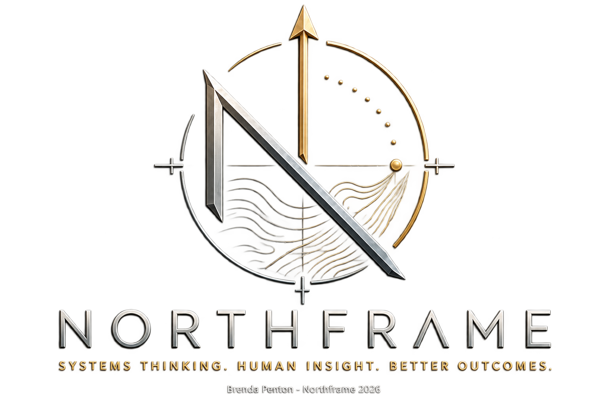

# NORTHFRAME

<!-- markdownlint-configure-file { "MD033": { "allowed_elements": ["div", "img", "p", "sub"] } } -->
<!-- HTML provides centering, image sizing, and footer formatting. -->

**Systems Thinking. Human Insight. Better Outcomes.**

**Northframe is currently in development and is not yet a fully established consulting company.** Its methods, services, and frameworks are evolving through practical work and continued learning.

## OPEN TO PROJECT WORK

I am open to either a **Northframe Read** or **embedded project work** in **marketing, positioning, strategy, research, community, documentation, project development, and early-stage problem-solving**.

* **Northframe Read:** An outside review of a project, idea, or system to identify gaps, friction, missing connections, and practical next steps.
* **Embedded project work:** Working alongside a founder or team to help research, clarify, develop, document, and move a project forward.

## About

Northframe is an evolving independent practice focused on understanding how projects, products, processes, and digital systems work as a whole.

The work combines systems thinking, research, human behaviour, structured analysis, and practical problem-solving to identify gaps, reduce friction, improve clarity, and support better decisions.

Northframe is especially interested in the space between a strong idea and a functioning project: the missing connections, unclear structures, overlooked human needs, and practical details that often determine whether something works outside of theory.

## What Northframe Can Support

### System and Project Reviews

Reviewing a project, product, workflow, service, or internal structure to identify:

* gaps and overlooked dependencies
* unnecessary complexity
* recurring friction
* unclear processes or responsibilities
* communication breakdowns
* missing documentation
* misalignment between the original goal and the current structure
* opportunities to simplify, strengthen, or improve

These reviews are practical and exploratory. They are not financial, legal, compliance, cybersecurity, or smart-contract audits.

### Gap and Friction Analysis

Looking closely at where a system becomes confusing, inefficient, inconsistent, or difficult to use.

This may involve:

* identifying what is missing
* finding where users or team members may become stuck
* examining repeated problems
* separating symptoms from underlying causes
* comparing intended use with actual use
* identifying assumptions that have not been tested
* organizing scattered issues into a clearer picture

### Human-Centred Systems Thinking

Examining how people actually experience and interact with a system, rather than focusing only on how it was designed.

Areas of consideration may include:

* behaviour and motivation
* trust and clarity
* decision-making
* psychological friction
* cognitive load
* onboarding and adoption
* engagement
* communication
* accessibility
* user expectations
* emotional responses to confusing or poorly structured systems

The aim is to make systems easier to understand, navigate, and use.

### Research and Analysis

Investigating complex subjects, gathering useful information, and turning it into clear findings.

This may include:

* market and ecosystem research
* competitor research
* comparative analysis
* product and service research
* user and audience research
* identifying patterns across multiple sources
* exploring opportunities, risks, and unanswered questions
* creating structured notes, summaries, and recommendations

### Practical Problem-Solving

Helping define the actual problem before jumping to a solution.

This may involve:

* clarifying the goal
* identifying constraints
* separating urgent issues from important ones
* tracing how one problem affects other parts of the system
* examining possible causes
* considering human and operational factors
* developing practical options
* prioritizing next steps

The goal is not to add more complexity. It is to make the situation easier to understand and act on.

### Structure and Process Development

Helping turn loose ideas, scattered information, or inconsistent workflows into something more usable.

Possible work may include:

* organizing project information
* outlining workflows
* developing review checklists
* creating internal documentation
* clarifying roles and responsibilities
* mapping user or customer journeys
* improving onboarding
* developing repeatable processes
* building research and decision-making frameworks
* creating project roadmaps and priority lists

### Communication and Technical Translation

Helping make complex, technical, or abstract ideas easier to understand.

This may include:

* translating technical concepts into plain language
* improving project descriptions
* organizing documentation
* clarifying product or service messaging
* structuring educational or explanatory content
* identifying where communication creates confusion
* helping technical and non-technical people understand one another

### Product and Project Clarity

Helping a project explain what it is, who it is for, and why it matters.

This may involve:

* clarifying the core idea
* identifying the intended audience
* defining the problem being solved
* examining whether the current structure supports the goal
* improving how the project is presented
* identifying missing user-facing information
* organizing features, services, or priorities
* supporting early-stage concept development

## How Northframe Approaches a Project

Northframe begins with a small group of connected questions:

1. **What is this project or system trying to accomplish?**
2. **What is currently happening in practice?**
3. **Where are the goals, people, processes, and structure becoming disconnected?**
4. **What information or perspective is missing?**
5. **What practical changes could improve the outcome?**

The process may include research, observation, structured questioning, review of existing materials, gap analysis, and written recommendations.

## Models, Maps & Frameworks

These working models illustrate Northframe's approach to business structure, hidden friction, and outside perspective. They are part of the framework's ongoing development.

| Built-In Marketability | The Hidden Fracture Map | The Perspective Gap |
| --- | --- | --- |
|  |  |  |
| Designing marketability and feedback into the business from the start. | Looking beneath the visible issue to find what shapes the outcome. | Testing an idea beyond the founder's own view. |

Select a graphic to view it at full size, or [explore all models, maps, and frameworks](Models%2C%20Maps%20%26%20Frameworks/).

## Potential Areas of Work

Northframe may support:

* early-stage business ideas
* digital products and services
* technical projects
* emerging-technology projects
* online communities
* content and communication systems
* user journeys and onboarding
* internal workflows
* research-heavy projects
* documentation projects
* founders and small teams
* independent creators
* projects needing an outside systems perspective

## What Northframe Is Not

Northframe does not currently provide:

* financial audits
* accounting services
* legal advice
* regulatory or compliance assessments
* cybersecurity audits
* smart-contract audits
* penetration testing
* formal psychological assessment
* licensed clinical services
* certified management consulting

Northframe provides research, systems review, structured analysis, human-centred insight, and practical problem-solving.

## Company Status

Northframe Systems Inc. has been approved and reserved as a corporate name with the Newfoundland and Labrador Registry of Companies.

* **Name Reservation:** Approved
* **Jurisdiction:** Newfoundland and Labrador, Canada
* **Reservation Date:** August 10, 2026
* **Current Stage:** Incorporation pending

Northframe is currently being developed alongside my Enterprise Web Development studies at the College of the North Atlantic, with the technical, business, and systems knowledge gained through the program feeding into its continued development.

Corporate name reservation does not represent completed incorporation. This section will be updated following incorporation.

## Repository Purpose

This repository will be used to explore and document:

* service ideas
* working methods
* review frameworks
* research
* templates
* sample projects
* case studies
* internal processes
* potential tools
* future offerings

The scope will continue to evolve as Northframe’s methods, experience, and areas of focus develop.

## Founder

Northframe was developed by Brenda Penton from a long-standing interest in business structure, marketing psychology, technology, pattern mapping, and how systems evolve.

Her background includes business and office administration, organizational operations, IT-related consulting, cryptocurrency projects, marketing, research, and practical systems analysis.

Northframe formalizes an approach she has used informally for years: looking beyond the visible problem, mapping the relationships around it, and tracing downstream issues back to the upstream decisions that created them.

[Read the full founder background](FOUNDER.md)

## Earlier Consulting Experience

My earlier consulting and project experience informs Northframe's methods and perspective. That work predates Northframe and is not being retroactively presented as formal Northframe case studies.

Some prior client and project details are intentionally not published. The public material here represents only what I have chosen to share, rather than a complete record of earlier work.

## Current Education

I am currently studying **Enterprise Web Development part-time through Distributed Learning at College of the North Atlantic**.

* **Current course:** Problem Solving for IT.
* **Credit/exemption granted:** Technical Report Writing.
* **Current plan:** Move to full-time studies in **2027**, subject to project and employment commitments.

The technical, business, and systems knowledge gained through these studies continues to inform Northframe's development.

---

**See the whole system. Find what is missing. Build what works.**

---

  © 2026 Brenda Penton · Northframe. All rights reserved.

